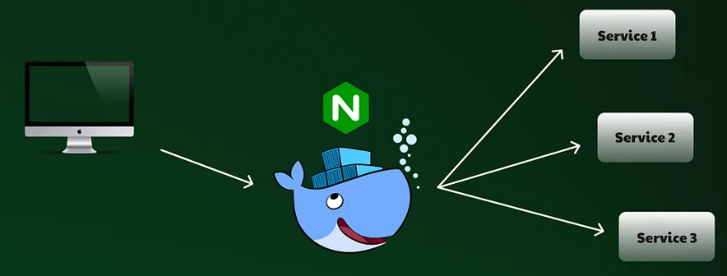

## Reverse-Proxy use Container

## Architecture



## Dockerfile (React)

```Dockerfile
## Build (node)
FROM node:16-alpine as builder

WORKDIR /usr/src/app

COPY package.*json .
RUN npm install

COPY . .
RUN npm run build

## Runner (nginx)
FROM nginx:alpine

RUN rm -rf /etc/nginx/conf.d/*
COPY --from=builder /usr/src/app/build/ ./usr/share/nginx/html
COPY nginx.conf /etc/nginx/conf.d/my_app.conf

EXPOSE 80

CMD ["nginx", "-g", "daemon off;"]
```

## Thanks to

- <a href="https://github.com/Jaehyuksssss"> 임재혁 Git Repository </a>

```
    // 재혁이가 본인꺼 쓰라고 기부해주심 감사
    docker push zkfmapf123/e-commerce:tagname
```
